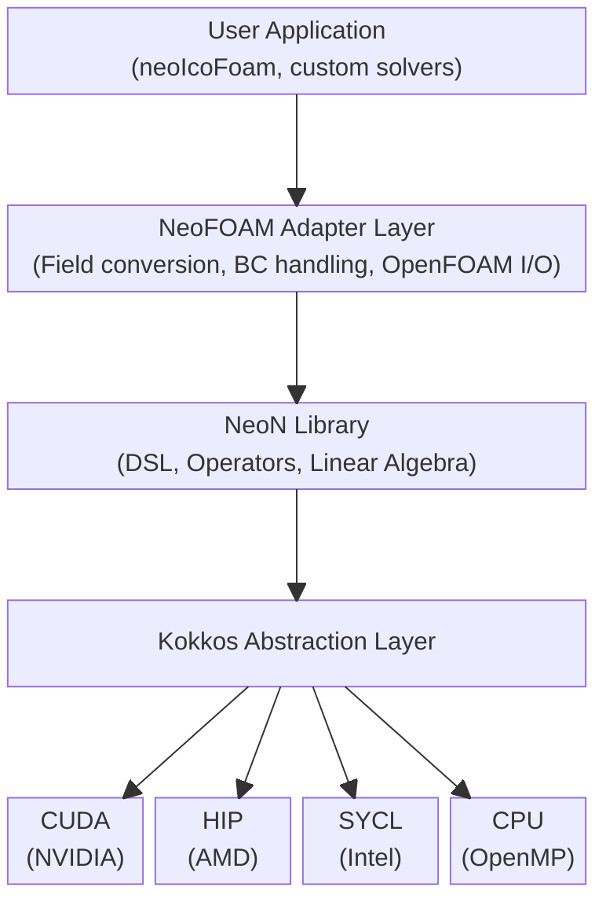

# NeoFOAM: Technical feasibility; current state

GPU support approach, for devs

---
layout: two-cols
---

# The story

<br>

<Toc :columns="2" :mode="onlyCurrentTree" />

---
transition: fade-out
---

# Overview

<br>

- NeoFOAM is **an adapter library** that enables GPU acceleration for OpenFOAM-style CFD applications
- Through the **NeoN** computational backend
- **Kokkos** for portability across NVIDIA (CUDA), AMD (HIP), and Intel (SYCL) GPUs
- Promises to maintain OpenFOAM API compatibility

<br>

---
transition: slide-up
---

# Architecture Overview

<br>



---

# GPU Kernel Patterns


<br>

`field.apply(SOME_LAMBDA)`:

```cpp
// From src/algorithms/pressureVelocityCoupling.cpp
rAU.internalVector().apply(NEON_LAMBDA(const size_t celli) {
    auto diagOffsetCelli = diagOffset[celli];
    return vol[celli] / (values[rowPtrs[celli] + diagOffsetCelli][0]);
});
```

<br>

- `apply()` transforms each element in parallel
- `NEON_LAMBDA` ensures portability across backends

---
hideInToc: true
---

# GPU Kernel Patterns

<br>

`NeoN::parallelFor`:

```cpp
// From src/algorithms/pressureVelocityCoupling.cpp
NeoN::parallelFor(
    exec,
    {0, nInternalFaces},
    NEON_LAMBDA(const size_t facei) {
        auto own = owner[facei];
        auto nei = neighbour[facei];
        auto lower = values[rowNeiStart + neiOffs[facei]];
        auto upper = values[rowOwnStart + ownOffs[facei]];

        NeoN::atomic_sub(&internalHbyA[nei], lower[0] * internalU[own]);
        NeoN::atomic_sub(&internalHbyA[own], upper[0] * internalU[nei]);
    }
);
```

---
hideInToc: true
---

# GPU Kernel Patterns

<br>

`views, efficient unpacking`:

```cpp
// Efficient view unpacking for GPU kernels
const auto [owner, neighbour, ownOffs, neiOffs, internalU] = views(
    mesh.faceOwner(),
    mesh.faceNeighbour(),
    sparsityPattern.ownerOffset(),
    sparsityPattern.neighbourOffset(),
    u.internalVector()
);
```

<br>

- Structured bindings for clean multi-array access
- Views are lightweight handles to GPU memory

---
hideInToc: true
---

# GPU Kernel Patterns

<br>

`NeoN::map, NeoN::transform`:

```cpp
NeoN::map(
    nfT.internalVector(),
    NEON_LAMBDA(const std::size_t celli) {
        return nfTOldView[celli] - 1.0;
    }
);
```

<br>

- Functional-style transformations
- Automatically parallelized on the target device

---

# Memory Management

<br>

- Device-Host Transfers

```cpp
// Copy from GPU to host for verification/output
auto hostCopy = deviceField.copyToHost();
auto view = hostCopy.view();

// Access elements on host
for (size_t i = 0; i < view.size(); i++) {
    std::cout << view[i] << std::endl;
}
```

- Fill/Initialize on Device

```cpp
NeoN::fill(nu.internalVector(), viscosity.value());
NeoN::fill(hByA.internalVector(), NeoN::zero<Vec3>());
```

---

# The NEON_LAMBDA Macro

Compiler-agnostic lambda syntax that works across CUDA, HIP, and SYCL:

```cpp
// Looks like this:
// - CUDA: __device__ lambda
// - HIP: __device__ lambda
// - SYCL: Lambda with proper capture
// - CPU: Standard C++ lambda

field.apply(NEON_LAMBDA(const size_t i) {
    return someComputation(i);
});
```

---

# Linear Solver GPU Integration

NeoFOAM uses **Ginkgo** for GPU-accelerated linear algebra:

```json
// Solver configuration via fvSolution or JSON
// Example: config.bj.json
{
  "type": "solver::Cg",
  "preconditioner": {
    "type": "preconditioner::Jacobi",
    "max_block_size": 1
  },
  "criteria": [
    {"type": "Iteration", "max_iters": 1000},
    {"type": "ResidualNorm", "reduction_factor": 1e-05}
  ]
}
```

<br>

- Supports PCG and few of its variants

---

# Developer Experience

API Comparison: OpenFOAM vs NeoFOAM

| Aspect | OpenFOAM | NeoFOAM |
|--------|----------|---------|
| Field Types | `volScalarField` | `VolumeField<NeoN::scalar>` |
| Operators | `fvm::ddt()`, `fvc::div()` | `dsl::imp::ddt()`, `dsl::exp::div()` |
| Matrix Systems | `fvScalarMatrix` | `PDESolver<T>` |
| Mesh Access | Direct `fvMesh` | `MeshAdapter` + `nfMesh()` |
| Boundary Conditions | `boundaryField()` | `boundaryConditions()` + `boundaryData().value()` |

